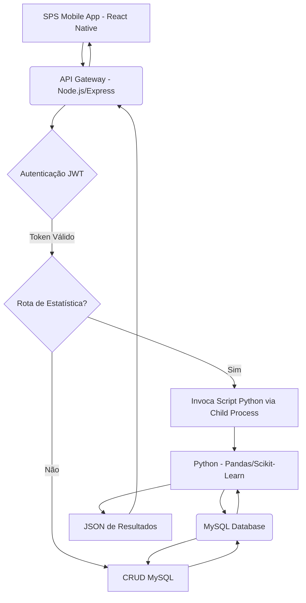

# 📱 SPS Mobile - Sistema Positivo de Saúde (Imunologia)


> Este projeto integrador foi desenvolvido no curso de **Análise e Desenvolvimento de Sistemas** com o objetivo de modernizar a gestão de clínicas de saúde e centros acadêmicos focados em imunologia.

## 📖 Sobre o Projeto

O **SPS Mobile** é uma solução de software multiplataforma (Android/iOS) que visa substituir processos manuais e sistemas legados, digitalizando integralmente o fluxo de atendimento e gestão de dados em clínicas.

O foco central do sistema é o **gerenciamento de exames imunológicos** (como COVID-19, Dengue e Tipagem Sanguínea), integrando rotinas administrativas com um módulo de **Inteligência de Dados** para análise de saúde populacional e apoio à decisão clínica.

## 🚀 Funcionalidades Principais

O sistema é dividido em módulos que abrangem desde a gestão de pacientes até a análise de dados avançada.

### 🩺 Gestão de Saúde e Operacional

| Funcionalidade | Descrição |
| :--- | :--- |
| **Gerenciamento de Pacientes** | Cadastro completo, histórico de exames e edição de dados cadastrais. |
| **Controle de Agendamentos** | Vínculo de pacientes a datas e tipos de exames, otimizando o fluxo de atendimento. |
| **Registro de Exames** | Formulários específicos para registro de resultados de exames, incluindo: **COVID-19** (registro de nível de anticorpos IgG/IgM quantitativo), **Dengue** e **Tipagem Sanguínea (ABO)**. |
| **Relatórios** | Geração de PDFs consolidados para impressão e exportação individual de Cartão de Paciente via compartilhamento nativo do celular. |

### 📊 Data Science & Inteligência

O sistema incorpora um módulo em Python para gerar inteligência a partir dos dados coletados, transformando dados brutos em *insights* acionáveis.

*   **Regressão Linear Simples:** Análise de correlação entre **Idade** (variável independente) e **Resposta Imunológica** (variável dependente).
*   **Análise de Tendência:** Visualização de linhas de tendência separadas para grupos Positivos e Negativos.
*   **Estatística Descritiva (AED):** Cálculo de métricas essenciais como Média, Mediana, Desvio Padrão e Variância.

### 🔐 Segurança e Acesso

*   **RBAC (Role-Based Access Control):** Diferenciação de acesso entre perfis `ADM` (Gestão total) e `DEFAULT` (Alunos/Operacional).
*   **Autenticação JWT:** Implementação de Login seguro via **JSON Web Token** e senhas criptografadas com **Bcrypt**.

## 🛠️ Tecnologias Utilizadas (A Stack)

O projeto adota uma arquitetura moderna, integrando microsserviços e múltiplas linguagens para otimizar o desempenho e a escalabilidade.

| Módulo | Tecnologia | Detalhes |
| :--- | :--- | :--- |
| **Frontend (Mobile)** | **React Native** com **Expo** | Desenvolvimento multiplataforma (Android/iOS), utilizando **React Navigation** para rotas, **Axios** para comunicação (com Interceptors para JWT) e **React Native Chart Kit** para visualização de dados. |
| **Backend (API)** | **Node.js** com **Express** | API RESTful seguindo o padrão **MVC**. Utiliza **MySQL** (`mysql2`) como banco de dados e **JWT/Bcrypt** para segurança. |
| **Data Science** | **Python 3** | Módulo analítico que utiliza **Pandas** (manipulação de DataFrames), **Scikit-Learn** (Regressão Linear), **Statsmodels** (cálculos estatísticos) e **SciPy** (testes de normalidade). |

## 🧩 Arquitetura do Fluxo de Dados

A arquitetura é baseada na comunicação entre o aplicativo, a API e o módulo de Data Science, garantindo que a análise de dados seja processada de forma assíncrona e eficiente.



**Fluxo de Análise de Dados:**
1.  O **App (React Native)** envia uma requisição para a API.
2.  O **Node.js** valida o Token JWT.
3.  Se a rota for de estatística, o Node.js invoca o **Script Python** via *Child Process* (`spawn`).
4.  O **Python** conecta ao MySQL, processa a Regressão Linear/AED e retorna um JSON.
5.  O **Node.js** repassa o resultado para o App renderizar os gráficos.

## 👥 Autores e Distribuição de Responsabilidades

O projeto foi desenvolvido de forma colaborativa, com a seguinte distribuição de responsabilidades técnicas:

| Integrante | Responsabilidades Principais |
| :--- | :--- |
| **Lucas Landgraf** | • Autenticação e Segurança (Login/JWT)<br>• Gestão de Usuários (Alunos)<br>• Módulo de Data Science & Integração Python<br>• Geração de Relatórios (PDF)<br>• UI/UX e Frontend Styling |
| **Allyson Kenzo Kawagoe** | • Gestão de Agendamentos (Lógica e Vínculos)<br>• Gestão de Exames (Formulários Dinâmicos)<br>• CRUD de Pacientes (Base do sistema)<br>• Lógica de negócios de saúde |

> *Nota: Embora as responsabilidades tenham sido divididas, o desenvolvimento ocorreu via Pair Programming e intervenções cruzadas para garantir a integração Back/Front-end.*

## 🏁 Como Executar o Projeto

Para rodar o **SPS Mobile** em seu ambiente local, siga os passos abaixo.

### Pré-requisitos

Certifique-se de ter as seguintes ferramentas instaladas:

*   **Node.js** e **NPM/Yarn** (para o Backend e Mobile).
*   **Python 3.x** (para o módulo de Data Science).
*   **Servidor MySQL** rodando (ex: XAMPP, Docker, MySQL Workbench).

**Dependências Python:**
As bibliotecas Python necessárias são: `pandas`, `scikit-learn`, `mysql-connector-python`, `statsmodels`, e `scipy`.

> **Dica:** Para facilitar a instalação, crie um arquivo `requirements.txt` na pasta do script Python e use `pip install -r requirements.txt`.

### Passo a Passo

1.  **Clone o repositório**
    ```bash
    git clone [https://github.com/lucaslandgraf/APPCRUD.git](https://github.com/lucaslandgraf/APPCRUD.git)
    ```

2.  **Configuração do Backend (API)**
    ```bash
    cd APPCRUD/backend
    npm install
    # ⚠️ Configure o arquivo .env com suas credenciais do banco de dados MySQL
    node server.js
    ```
    O servidor da API estará rodando, geralmente na porta 3000.

3.  **Configuração do Mobile (Frontend)**
    ```bash
    cd ../mobile
    npm install
    npx expo start
    ```
    O Expo iniciará o servidor. Você pode escanear o QR Code com o aplicativo Expo Go no seu celular ou rodar em um emulador.

## 📝 Licença

Este projeto foi desenvolvido exclusivamente para **fins acadêmicos** e de portfólio.
